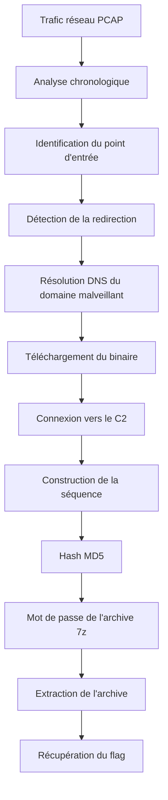
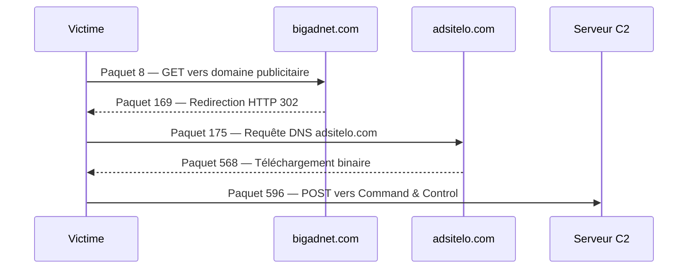
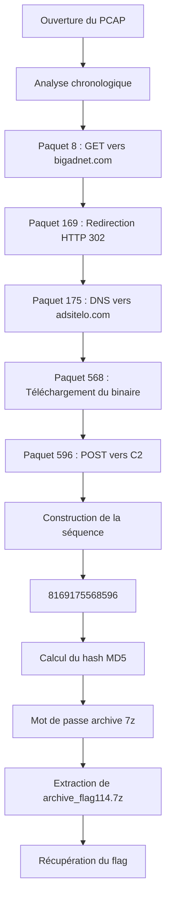

---
Flag n°0114 — Séquence d'attaque et archive 7z
description: Write-up moderne du challenge réseau basé sur l’analyse d’une chaîne d’infection, la reconstruction chronologique des paquets et le déverrouillage d’une archive 7z avec un hash MD5.
---

# 🚩 Flag n°0114

## Séquence d'attaque et archive 7z


---

## Vue rapide du challenge

| Élément | Détail |
|---|---|
| **Catégorie** | Réseaux / Network Forensics |
| **Nom du challenge** | Chronologie d'une Compromission — L'Archive Malveillante |
| **Type d’analyse** | Analyse PCAP |
| **Type d’attaque** | Malvertising |
| **Objectif principal** | Reconstruire la chronologie d’une compromission |
| **Archive** | `archive_flag114.7z` |
| **Protection** | Mot de passe basé sur un hash MD5 |
| **Difficulté** | ⭐⭐⭐ Moyen |
| **Points** | 300 pts |
| **Durée estimée** | Environ 60 minutes |

---

## Thème du Flag

!!! abstract "Thème principal"
    **Network Forensics — Malware Traffic Analysis — Analyse d’une infection de bout en bout**

---

## Vue d’ensemble

Le challenge repose sur l’analyse d’un trafic réseau contenant une attaque de type **Malvertising**.

Le participant doit retrouver les étapes importantes de l’attaque dans le bon ordre chronologique.

Les numéros des paquets clés doivent ensuite être concaténés avec des `_`, puis transformés en empreinte **MD5**.

Cette empreinte MD5 devient le mot de passe permettant d’extraire une archive `.7z`.

---

## Nom du Flag

**Chronologie d'une Compromission — L'Archive Malveillante**

---

## I - Pourquoi ce flag ?

L’objectif de ce challenge est de faire pratiquer l’analyse complète d’une chaîne d’infection dans un trafic réseau.

Le participant ne doit pas seulement trouver un paquet suspect. Il doit reconstruire toute la progression de l’attaque, étape par étape.

Ce challenge permet de travailler plusieurs compétences :

| Compétence | Objectif |
|---|---|
| **Analyse chronologique** | Reconstituer l’ordre exact des événements réseau |
| **HTTP** | Identifier les requêtes GET, POST et les redirections |
| **DNS** | Repérer la résolution d’un domaine malveillant |
| **Malware Traffic Analysis** | Identifier un téléchargement suspect |
| **C2** | Repérer une communication Command & Control |
| **Hash MD5** | Générer un mot de passe à partir d’une séquence |

!!! note "Idée principale"
    L’archive `.7z` ne peut pas être ouverte simplement avec les numéros de paquets.

    Il faut d’abord comprendre la chronologie, construire la séquence, puis générer son empreinte MD5.

---

## II - Explication du flag

Le trafic contient une attaque de type **Malvertising**.

Dans ce scénario, la victime passe par plusieurs étapes avant la compromission complète :

1. accès à un domaine publicitaire suspect ;
2. redirection vers une ressource malveillante ;
3. résolution DNS du domaine malveillant ;
4. téléchargement d’un binaire ;
5. communication avec un serveur C2.

Ces étapes sont représentées par cinq paquets clés.

La séquence des numéros de paquets est ensuite concaténée avec des `_`.

Cette chaîne est ensuite hachée avec **MD5**.

Le hash obtenu constitue le mot de passe de l’archive `.7z`.

---

## Fonctionnement du challenge



!!! important "Point important"
    La difficulté du challenge n’est pas seulement technique.

    Le participant doit surtout retrouver le bon **ordre chronologique** des événements.

---

## III - Solution détaillée

### Étape 1 — Comprendre la méthodologie Kill Chain

Le participant doit analyser le trafic comme une chaîne d’infection.

L’objectif est de retrouver les transitions majeures de l’attaque :

```text
Entrée
  │
  ▼
Redirection
  │
  ▼
Résolution DNS
  │
  ▼
Téléchargement du binaire
  │
  ▼
Connexion C2
```

Chaque étape correspond à un paquet précis.

---

### Étape 2 — Identifier le point d’entrée

Le premier paquet important correspond au point d’entrée de l’attaque.

Filtre Wireshark :

```text
http.request.method == "GET"
```

On observe une requête HTTP vers un domaine publicitaire suspect :

```text
bigadnet.com
```

Le paquet correspondant est :

```text
8
```

!!! tip "Interprétation"
    Ce paquet représente l’entrée de la victime dans la chaîne d’infection.

---

### Étape 3 — Identifier la redirection

Après le point d’entrée, il faut rechercher une redirection HTTP.

Filtre Wireshark :

```text
http.response.code == 302
```

Le code HTTP `302` indique une redirection.

Il faut ensuite analyser le champ :

```text
Location
```

Le paquet correspondant est :

```text
169
```

!!! warning "Élément suspect"
    Une redirection dans une attaque de type Malvertising peut conduire la victime vers un domaine contrôlé par l’attaquant.

---

### Étape 4 — Identifier la résolution DNS

Après la redirection, le navigateur ou le système doit résoudre le domaine malveillant.

Filtre Wireshark :

```text
dns.flags.response == 0
```

Ce filtre permet d’afficher les requêtes DNS.

Le domaine malveillant résolu est :

```text
adsitelo.com
```

Le paquet correspondant est :

```text
175
```

!!! note "Rôle du DNS"
    Cette étape confirme que la machine tente de contacter un nouveau domaine lié à la chaîne d’infection.

---

### Étape 5 — Identifier le téléchargement du binaire

L’étape suivante correspond au téléchargement du binaire malveillant.

Filtre Wireshark :

```text
http.content_type == "application/x-msdownload"
```

Ce type de contenu est généralement associé à un exécutable Windows.

Le paquet correspondant est :

```text
568
```

!!! danger "Téléchargement malveillant"
    Le type `application/x-msdownload` est un indicateur fort de téléchargement d’un binaire exécutable.

---

### Étape 6 — Identifier la connexion C2

Après le téléchargement, on cherche une communication vers un serveur de Command & Control.

Filtre Wireshark :

```text
http.request.method == "POST"
```

Une requête `POST` peut indiquer un envoi de données vers un serveur distant.

Le paquet correspondant est :

```text
596
```

!!! bug "Activité C2"
    Cette étape correspond à la communication avec l’infrastructure de l’attaquant.

---

## Vue chronologique de l’attaque



---

## Récapitulatif des paquets clés

| Étape | Paquet | Filtre Wireshark | Élément observé |
|---|---:|---|---|
| Point d’entrée | `8` | `http.request.method == "GET"` | Domaine `bigadnet.com` |
| Redirection | `169` | `http.response.code == 302` | Champ `Location` |
| DNS | `175` | `dns.flags.response == 0` | Domaine `adsitelo.com` |
| Téléchargement | `568` | `http.content_type == "application/x-msdownload"` | Binaire Windows |
| Connexion C2 | `596` | `http.request.method == "POST"` | Activité Command & Control |

---

### Étape 7 — Construire la séquence finale

Les paquets trouvés dans l’ordre chronologique sont :

```text
8
169
175
568
596
```

Ils doivent être concaténés avec des `_`.

La séquence finale est donc :

```text
8169175568596
```

!!! success "Séquence correcte"
    ```text
    8169175568596
    ```

---

### Étape 8 — Générer le mot de passe MD5

Le mot de passe de l’archive n’est pas la séquence directement.

Il faut calculer le hash MD5 de la chaîne obtenue, sans saut de ligne.

Commande Bash :

```bash
echo -n "8169175568596" | md5sum
```

Résultat :

```text
27e2b1b3e8e19df2d6a5c1a7c5b1c0a0
```

Le mot de passe de l’archive est donc :

```text
27e2b1b3e8e19df2d6a5c1a7c5b1c0a0
```

!!! important "Attention"
    L’option `-n` avec `echo` est importante.

    Elle évite d’ajouter un saut de ligne à la fin de la chaîne avant le calcul du hash.

---

### Étape 9 — Extraire l’archive 7z

Une fois le mot de passe obtenu, on peut extraire l’archive :

```bash
7z x -p"27e2b1b3e8e19df2d6a5c1a7c5b1c0a0" archive_flag114.7z
```

Après extraction, le contenu de l’archive permet de récupérer le flag.

---

## IV - Récupération du flag

!!! success "Flag récupéré"
    ```text
    CryptAbyss{1e6df7f44bf94df75de303c2723bfc4b3b756330e521ff7a1ef207822a9ffee5}
    ```

---

## V - Indices

### Indice léger

La chronologie est la clé.  
Isolez les paquets qui marquent les transitions majeures de l’attaque.

### Indice intermédiaire

Utilisez les filtres Wireshark pour isoler les méthodes HTTP, les redirections, les requêtes DNS et le type de contenu `application/x-msdownload`.

### Indice final

Ne tapez pas les numéros en clair dans 7zip.  
Le mot de passe est l’empreinte MD5 de la chaîne obtenue, sans saut de ligne.

---

## VI - Ce qu’il fallait apprendre

| Notion | Ce qu’il fallait comprendre |
|---|---|
| **Kill Chain** | Reconstruire une attaque étape par étape |
| **HTTP** | Identifier les requêtes GET, POST et les redirections 302 |
| **DNS** | Repérer la résolution d’un domaine malveillant |
| **Malware Traffic Analysis** | Détecter le téléchargement d’un binaire suspect |
| **C2** | Identifier une communication Command & Control |
| **MD5** | Générer un mot de passe à partir d’une séquence |

---

## VII - Durée approximative

!!! clock "Temps estimé"
    **Environ 60 minutes**

| Niveau du participant | Durée estimée |
|---|---:|
| Débutant en analyse réseau | 60 à 75 minutes |
| Niveau intermédiaire | 45 à 60 minutes |
| Habitué aux analyses PCAP | 30 à 45 minutes |

Difficulté :

```text
⭐⭐⭐ Moyen — 300 points
```

---

## VIII - Résumé de la résolution



---

## IX - Commandes utiles

### Filtrer les requêtes GET

```text
http.request.method == "GET"
```

### Filtrer les redirections HTTP

```text
http.response.code == 302
```

### Filtrer les requêtes DNS

```text
dns.flags.response == 0
```

### Filtrer le téléchargement du binaire

```text
http.content_type == "application/x-msdownload"
```

### Filtrer les requêtes POST

```text
http.request.method == "POST"
```

### Générer le hash MD5

```bash
echo -n "8169175568596" | md5sum
```

### Extraire l’archive

```bash
7z x -p"2a8f23a79d2d667f846caa98d3b3ebc8" archive_flag114.7z
```

---

## X - À retenir

!!! quote "Idée clé"
    Dans ce challenge, la solution ne dépend pas seulement d’un paquet isolé.

    Il fallait reconstruire toute la chronologie de l’attaque pour obtenir la bonne séquence.

---

## Vue finale

| Élément final | Valeur |
|---|---|
| **Séquence finale** | `8169175568596` |
| **Hash MD5** | `27e2b1b3e8e19df2d6a5c1a7c5b1c0a0` |
| **Archive** | `archive_flag114.7z` |
| **Flag final** | `CryptAbyss{1e6df7f44bf94df75de303c2723bfc4b3b756330e521ff7a1ef207822a9ffee5}` |

